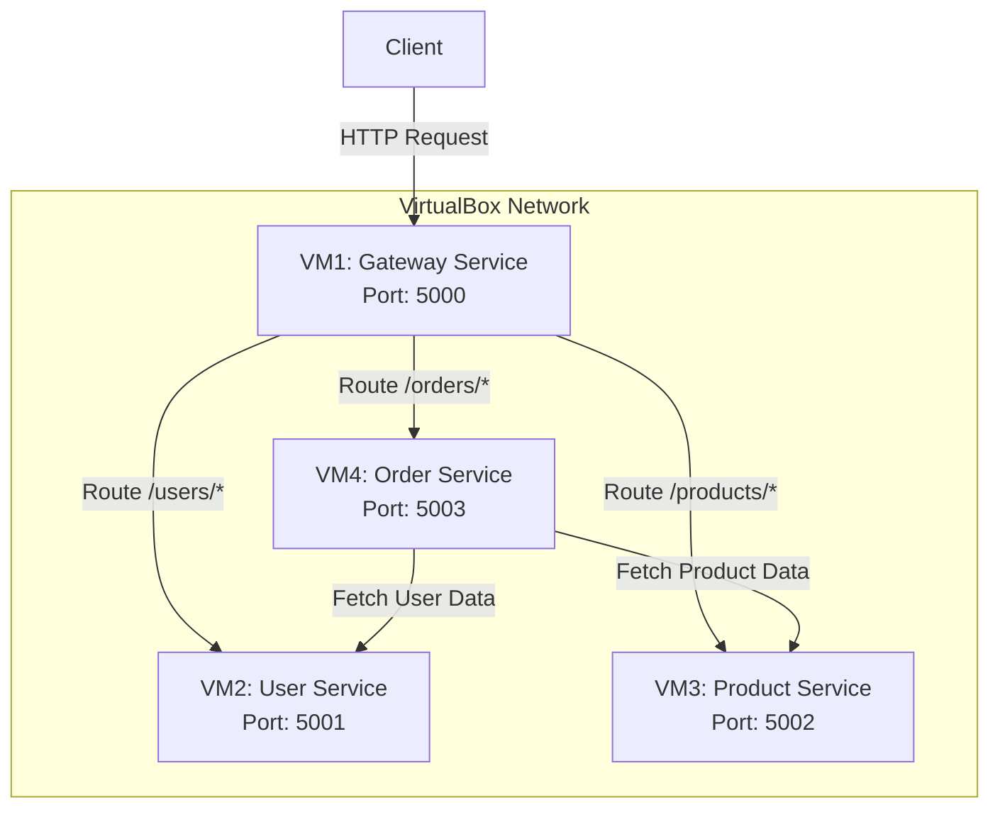

# SampleMicroService
A Simple Micro Service project executed on Virtual Machines

## Below is the overview of the working

```mermaid
graph TD
    subgraph VirtualBox Network
        VM1[VM1: Gateway Service<br>Port: 5000]
        VM2[VM2: User Service<br>Port: 5001]
        VM3[VM3: Product Service<br>Port: 5002]
        VM4[VM4: Order Service<br>Port: 5003]
    end

    Client -->|HTTP Request| VM1
    VM1 -->|Route /users/*| VM2
    VM1 -->|Route /products/*| VM3
    VM1 -->|Route /orders/*| VM4
    VM4 -->|Fetch User Data| VM2
    VM4 -->|Fetch Product Data| VM3
```
